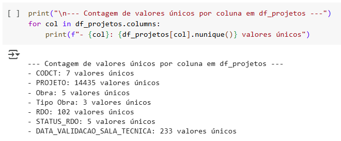

# **PUC_MVP_Aprender_Conectado**

## Um pouco sobre o tema

O projeto "**Aprender Conectado**" é uma iniciativa do governo federal brasileiro que visa levar internet de alta velocidade para escolas públicas de educação básica, com o objetivo de transformar o processo de aprendizagem e ampliar o acesso ao conhecimento para alunos e professores. O projeto faz parte da Estratégia Nacional de Escolas Conectadas (ENEC) e é financiado com recursos do leilão do 5G.

Este projeto é monitorado pela Entidade Administradora da Conectividade de Escolas (EACE), responsável pela implementação do mesmo, em parceria com o MEC, Ministério das Comunicações e Anatel, e supervisionado pelo Grupo de Acompanhamento do Custeio a Projetos de Conectividade de Escolas (GAPE), formado por 5 grandes empresas de Telecom do Brasil.

## Qual a proposta do MVP?

Neste trabalho, será desenvolvida uma solução que facilite na identificação de quais escolas foram de fato entregues, sem pendências, dentro do universo de escolas com obras já contratadas.

Cada escola tem a sua particularidade, com isso trabalha com escopo específico. O escopo de cada projeto é dividido em 3 tipos de obras:
1) Rede Interna
2) Rede Externa
3) Gerador Solar

A questão é analisar se as etapas previstas em cada escola foram concluídas e com isso classificar como Conectada.

### Porque?

A quantidade de escolas contempladas é bastante expressiva (já passa de 15 mil escolas e com previsão de mais contratação) e atualmente o acompanhamento de evolução das obras é bastante manual, apensar de contar com a ferramenta (Aniel - nosso sistema de workflow).

### Como?

Serão utilizadas 2 bases para montar o nosso Dataset:
- **Base de Projetos**: listando as atividades já realizadas em campo, com seus devidos status e agrupamentos por tipo de obra. É uma base exportada do Aniel.
- **Base de Escopo**: Listagem das escolas contempladas até a fase atual do projeto, com os respectivos escopos (Rede Interna, Rede Externa e Gerador Solar).

A **Base de Projetos** está verticalizada, ou seja, os status das etapas estão empilhados. Já a **Base de Escopo** já está bem definida, trazendo os escopos em 3 colunas distintas, para cada projeto, além da informação se a escola já está conectada (Sim/Não).

Para cruzar as bases, será necessário fazer uma análise exploratória em ambas, para enteder o conteúdo de cada uma e aplicar os tratamentos corretos, antes de realizar o cruzamento entre elas e comparar escopo com execução.

###Linguagem / Repositório / Links

Para rodar este projeto, é necessário ter o Python 3.1+ instalado, juntamente com as seguintes bibliotecas:
- pandas
- matplotlib
- seaborn
- sklearn (esta apenas na etapa de Machine Learning)

As bases estão disponíveis no Github. 
- https://github.com/dxspimentel/PUC

URLs importadas 
- github_projetos 
'https://raw.githubusercontent.com/dxspimentel/PUC/main/PUC_Db_01_Base_Projetos.csv'
- github_escopo 
'https://raw.githubusercontent.com/dxspimentel/PUC/main/PUC_Db_02_Base_Escopo.csv'

### Classificação

O alvo do trabalho é classificar a Escola como conectada ou não. Para isso a lógica utilizada será, por exemplo:

- Escola: 567235
- Escopo: RE + RI + GS (os 3 serviços possíveis)

Cruzaremos as bases, utilizando a coluna **PROJETO** como chave, para saber se a escola 567235 tem os 3 serviços concluídos (**STATUS_RDO** = '*Aprovado Sala Técnica*'). Se sim, a escola será classificada como conectada '*Sim*', caso contrário, conectada '*Não*'.

## Característas dos DataFrames
### df_projetos

Somente o atributo "**CODCT**" é do tipo _int64_. Necessário converte-lo para _object_.
  

"**DATA_VALIDACA_SALA_TECNICA**" é do tipo _object_. Necessário converte-la para _datetime_. 
  

 
Dados estatísticos do dataframe.
  

 
Valores úncios do dataframe.
  

### df_escopo

Somente o atributo "**PROJETO**" é do tipo _int64_. Necessário converte-lo para _object_.
  

"**DATA_VALIDACAO_SALA_TECNICA**" é do tipo _object_. Necessário converte-la para _datatime_. 
  

 
Dados estatísticos do dataframe.
  

 
Valores úncios do dataframe. Note que a coluna 'Energia compar' tem 3 valores únicos, porém ela não é necessária para o nosso trabalho e por isso será descartada.
  

## Tratamentos aplicados
Após verificações dos 2 dataframes, identifiquei algumas tratativas necessárias, antes de seguirmos com o trabalho.

1. Conversão da coluna PROJETO para tipo string (object)
2. Conversão da coluna DATA_VALIDACAO_SALA_TECNICA para tipo datetime
3. Padronização das colunas de Escopo (Escopo_RE, Escopo_RI, Escopo_GS, Escola Conectada) e conversão para boleano
4. Conversão da coluna CODCT para tipo string (object)
5. Padronização do agrupamento na coluna df_projetos['Tipo Obra']
6. Padronização do atributo df_projetos['STATUS_RDO']
7. Remoção da coluna df_escopo['Energia compart']

### Checagem dos dados após tratamentos

Tratamento df_projetos - Parte 1.
  

Tratamento df_projetos - Parte 2.
  

Tratamento df_escopo - Parte 1.
  

Tratamento df_escopo - Parte 2.
  

## Cruzamento dos DataFrames

O cruzamento é necessário para comparar o que a escola prevê no escopo (df_escopo) com o que já foi executado de fato (df_projetos).

Vale lembrar que em df_projetos, a evolução das etapas estão em linhas diferentes, ou seja, o mesmo projeto pode ter mais de uma etapa para seguir e cada etapa vai estar em linhas diferentes, com os respectivos STATUS_RDO.

Dito isto, o melhor a se fazer é manter apenas uma linha de cada projeto e criar colunas para identificar os status de cada etapa. Nesse caso, vamos criar colunas com valores binários para apontar o que precisamos em cada etapa (0 = não concluída, 1 = concluída).

### Visualização dos dados após cruzamento (merge)

  

  

  

  

## Conclusão

Para esta etapa do trabalho, conseguimos identificar em ambos DataFrames as necessidades de tratamentos/limpeza e respectivas soluções. Em seguida o cruzamento das tabelas foi bem sucedido, e a visualização dos dados satisfatória, demostrando que o Dataset final está pronto para ser utilizado em Machine Learning.
